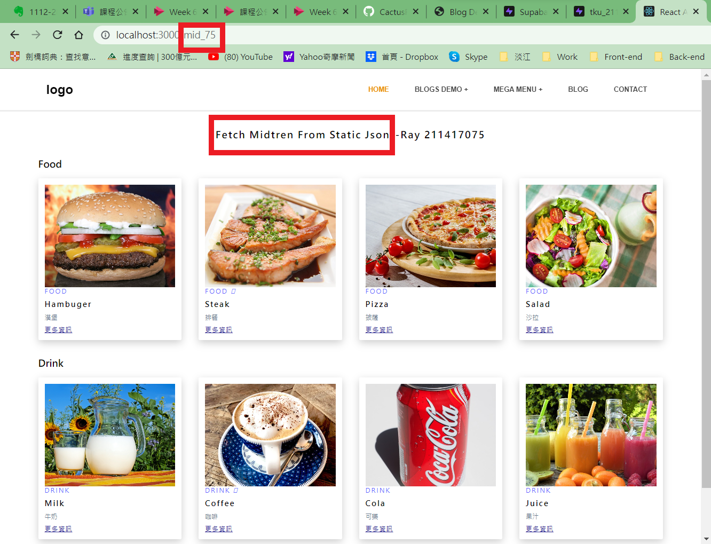
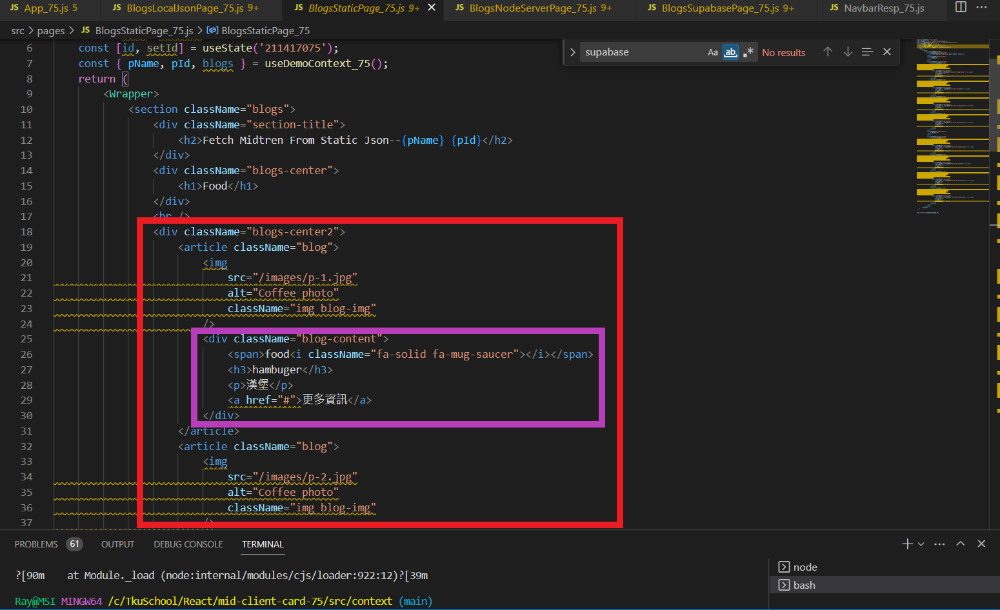
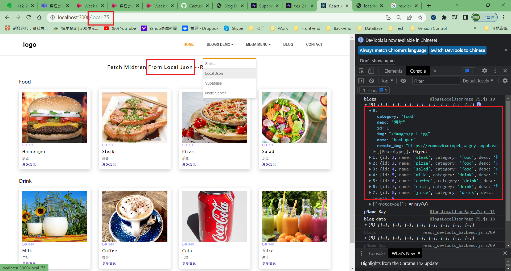
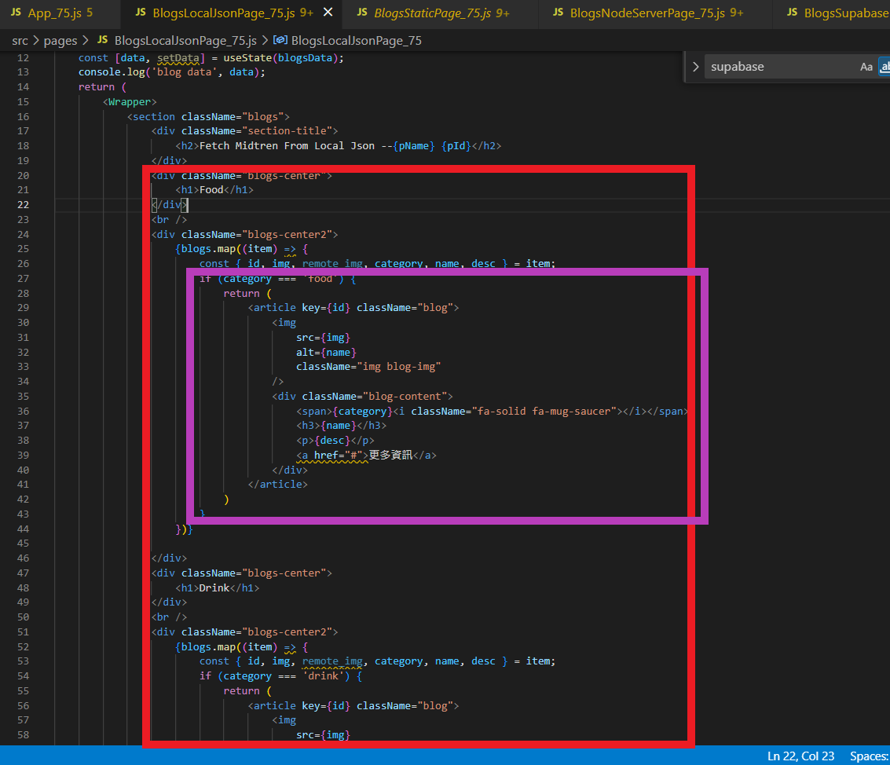
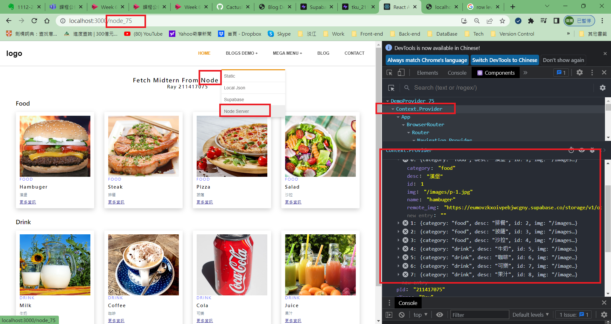
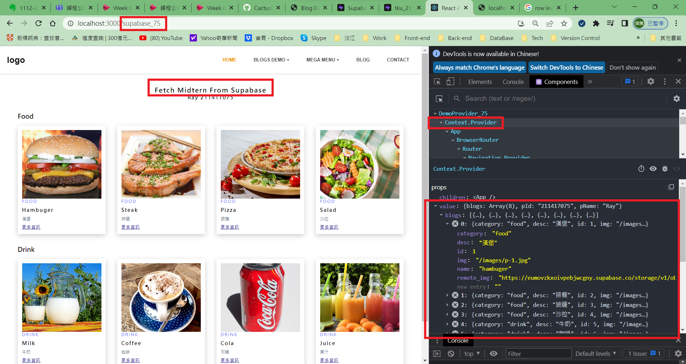
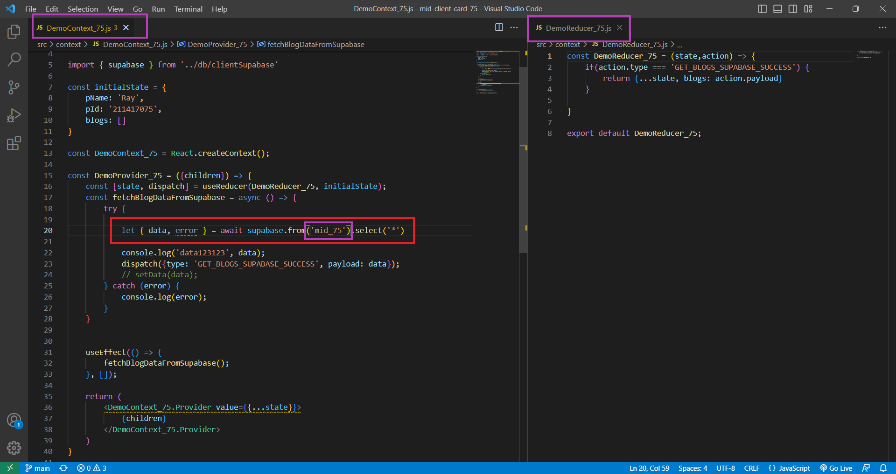

[Github URL](https://github.com/CactusRay/1112_wp2_demo_75)
### S1. 前端 theme (html, css)

### S2. 提供相關的SQL指令，顯示如何將theme 內data放入資料庫中

### S3. node.js server

### S4. 提供 api 路由，可以透過 api 路由取得 json data

### F1. 前端靜態頁面及local端資料(加入選單)

### F2. 可以透過 server api 取得json資料，放入 React components(加入選單)

### F3. 可以直接透過  Supabase API 取得React components 所要的json資料(加入選單)

### F4. 請使用 Context API 及 useReducer 來儲存資料

