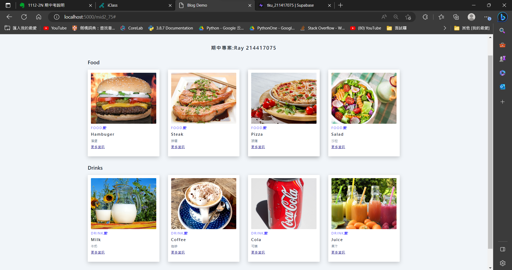
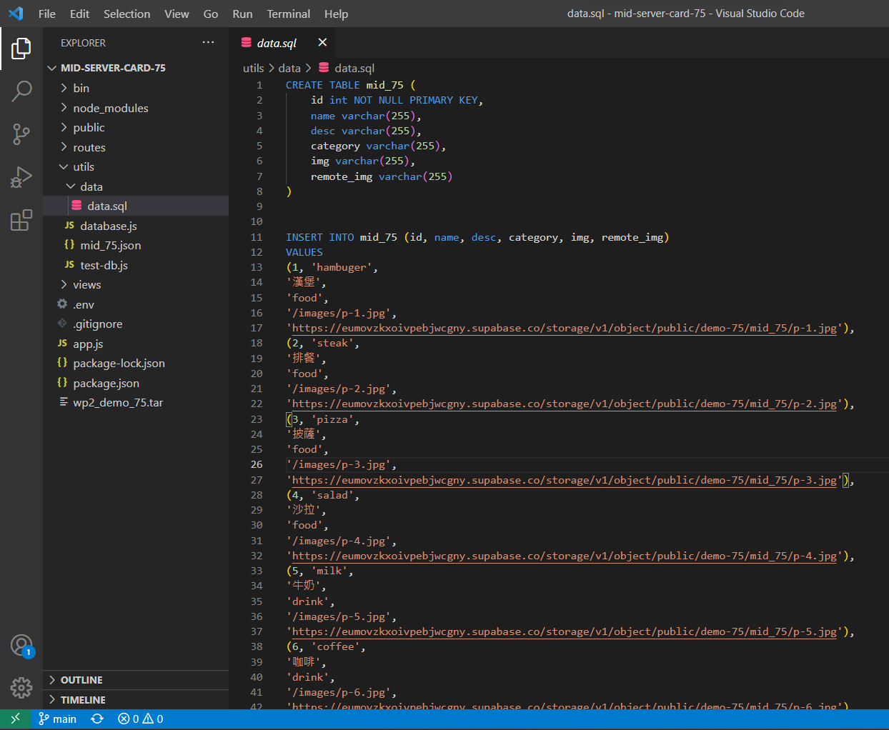
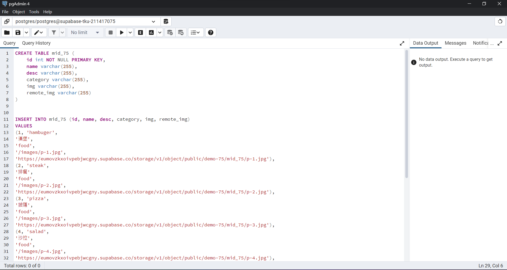
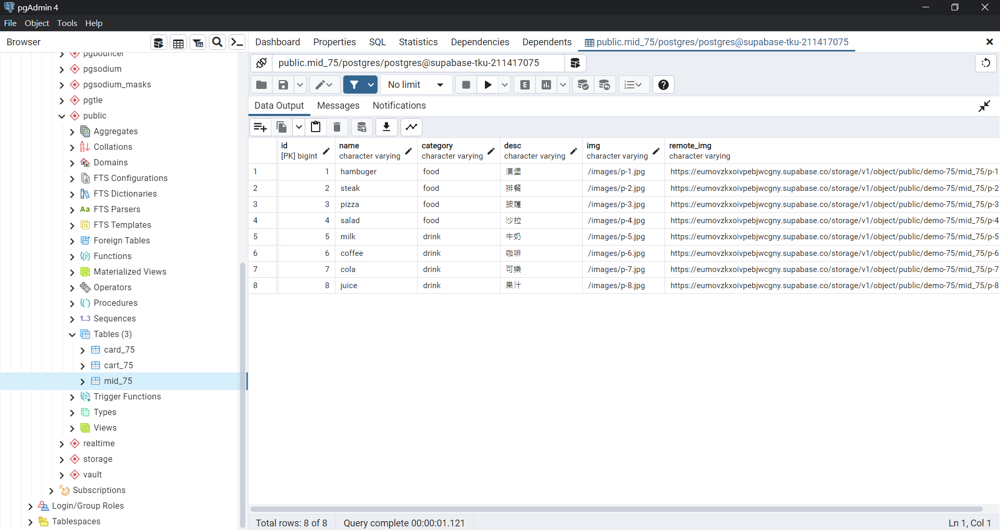
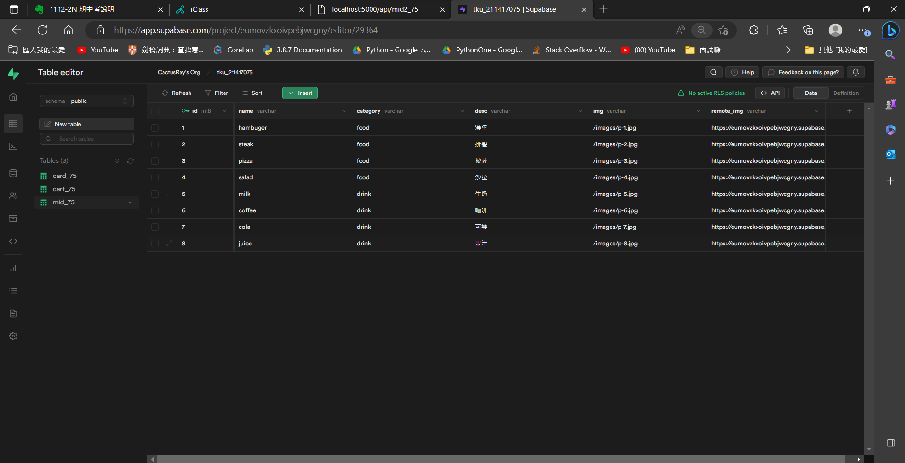
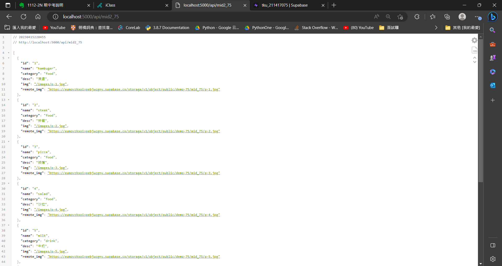

[Github URL](https://github.com/CactusRay/1112_wp2_demo_75)
### S1. 前端 theme (html, css)

### S2. 提供相關的SQL指令，顯示如何將theme 內data放入資料庫中

### S3. node.js server

### S4. 提供 api 路由，可以透過 api 路由取得 json data

