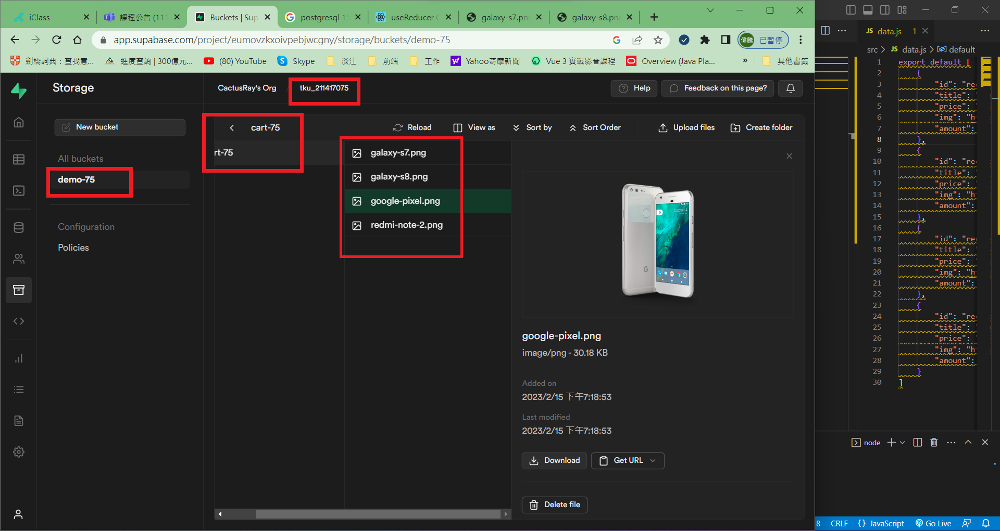
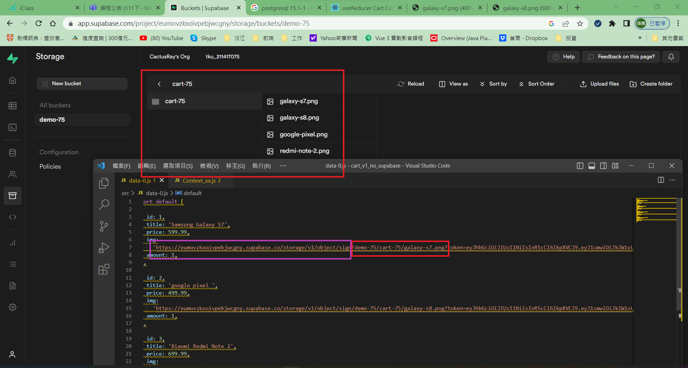
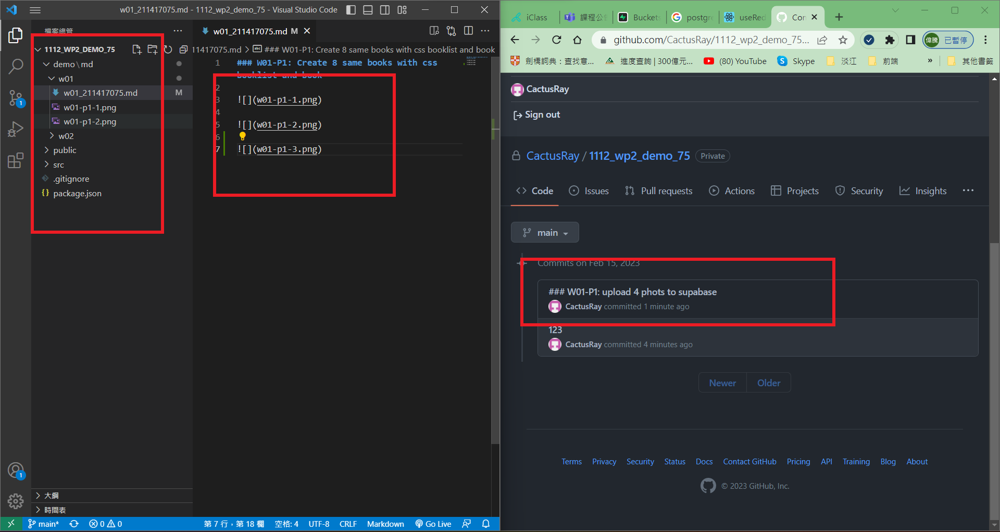
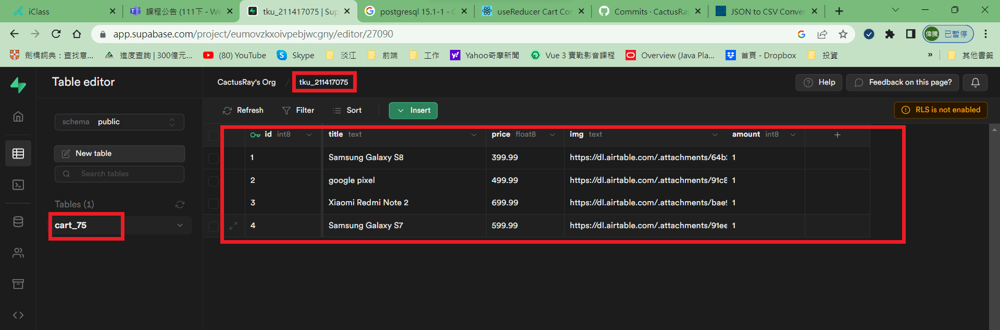
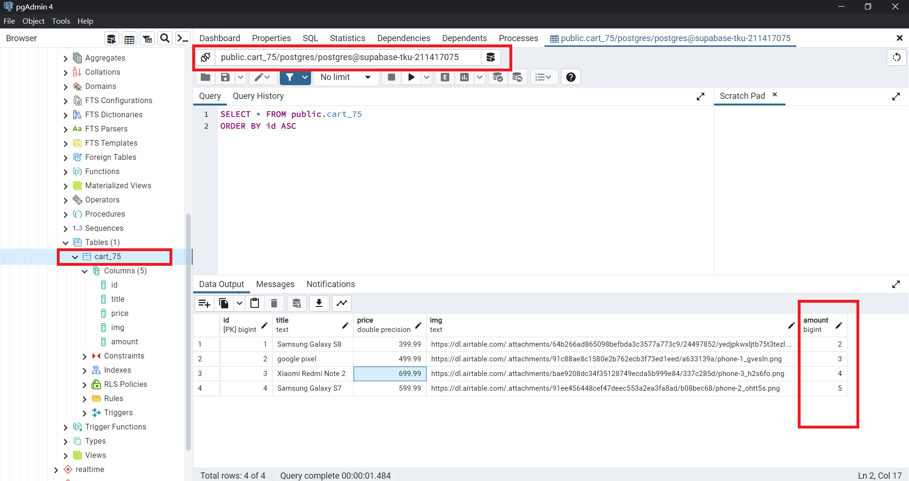
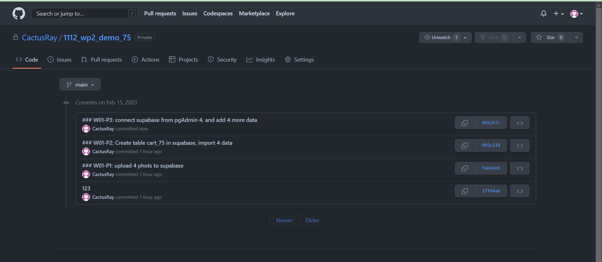

### W01-P1: Create 8 same books with css booklist and book

### W01-P2: Create table cart_75 in supabase, import 4 data

### W01-P3: connect supabase from pgAdmin 4, and add 4 more data
 

 

 

### W01-logs

